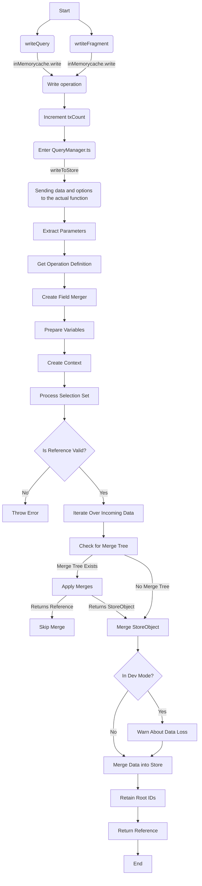

- npm run test:debug src/cache/inmemory/__tests__/cache.ts

### Explanation of the `writeToStore` Method

1. **Start (G):**
   - The method begins execution.

2. **Extract Parameters (H):**
   - Extract key parameters from the provided object: `query`, `result`, `dataId`, `variables`, and `overwrite`.

3. **Get Operation Definition (I):**
   - Retrieve the operation definition from the query, which includes the selection set.

4. **Create Field Merger (J):**
   - Create a field merger to assist in merging fields during the write process.

5. **Prepare Variables (K):**
   - Merge default values for variables with the provided variables.

6. **Create Context (L):**
   - Create a context object containing the store, written data tracker, merge function, variables, variable string, and other necessary flags and maps.

7. **Process Selection Set (M):**
   - Call the `processSelectionSet` method with the result, dataId, selection set, merge tree, and context to process the selection set and return a reference to the entity.

8. **Is Reference Valid? (N):**
   - Check if the reference returned from `processSelectionSet` is valid.

9. **Throw Error (O):**
   - If the reference is not valid, throw an error.

10. **Iterate Over Incoming Data (P):**
    - Iterate over the `incomingById` map in the context, which contains data that needs to be merged into the store.

11. **Check for Merge Tree (Q):**
    - Check if there is a merge tree to apply any necessary merges.

12. **Apply Merges (R):**
    - If a merge tree is present, apply merges to merge fields into the store.

13. **Skip Merge (S):**
    - If the result of applying merges is a reference, assume it has already been merged.

14. **Merge StoreObject (T):**
    - If the result of applying merges is a store object, merge it into the store.

15. **In Dev Mode? (U):**
    - Check if the code is running in development mode.

16. **Warn About Data Loss (V):**
    - In development mode, check for potential data loss and issue warnings if necessary.

17. **Merge Data into Store (W):**
    - Merge the store object into the store.

18. **Retain Root IDs (X):**
    - Retain any IDs written to the cache as reachable root IDs for garbage collection purposes.

19. **Return Reference (Y):**
    - Return the reference to the entity.

20. **End (Z):**
    - The method completes execution.

    
