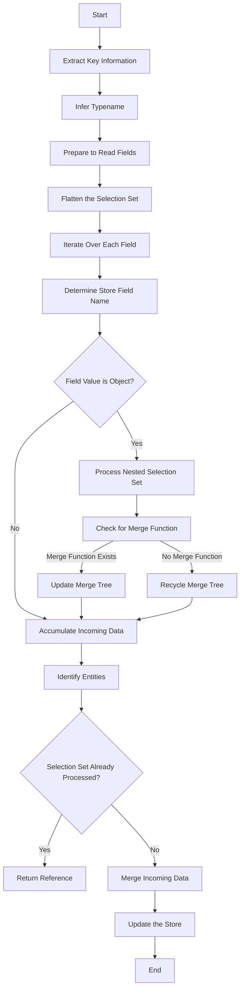

```mermaid
graph TD
    A[Start] --> B[Extract Key Information]
    B --> C[Infer Typename]
    C --> D[Prepare to Read Fields]
    D --> E[Flatten the Selection Set]
    E --> F[Iterate Over Each Field]
    F --> G[Determine Store Field Name]
    G --> H{Field Value is Object?}
    H -->|Yes| I[Process Nested Selection Set]
    H -->|No| J[Accumulate Incoming Data]
    I --> K[Check for Merge Function]
    K -->|Merge Function Exists| L[Update Merge Tree]
    K -->|No Merge Function| M[Recycle Merge Tree]
    L --> J
    M --> J
    J --> N[Identify Entities]
    N --> O{Selection Set Already Processed?}
    O -->|Yes| P[Return Reference]
    O -->|No| Q[Merge Incoming Data]
    Q --> R[Update the Store]
    R --> S[End]

```

